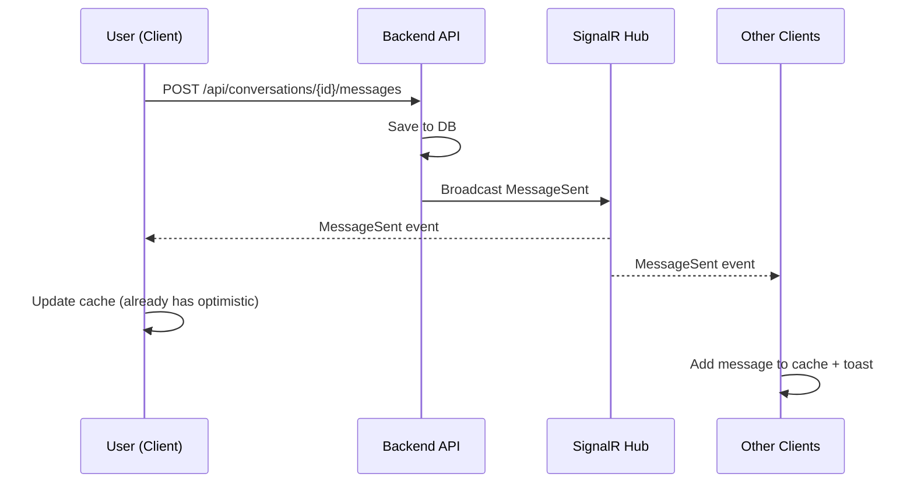

# Message Send & Receive - Implementation Plan

> **Feature:** Real-time Message Send & Receive  
> **Module:** Chat  
> **Status:** ✅ READY TO IMPLEMENT  
> **Created:** 2025-12-30

---

## 📋 Overview

Tài liệu này mô tả chi tiết cách implement tính năng **gửi và nhận tin nhắn real-time** dựa trên kiến trúc từ Vega.Chat.Client đã hoạt động.

**Reference:**

- [REALTIME_ARCHITECTURE.md](../../../REALTIME_ARCHITECTURE.md)
- [MESSAGE_FLOW_REALTIME.md](../../../MESSAGE_FLOW_REALTIME.md)

---

## 🔍 Current State Analysis

### ✅ Đã có sẵn trong project

| Component               | File                                    | Status         |
| ----------------------- | --------------------------------------- | -------------- |
| SignalR Hub Class       | `src/lib/signalr.ts`                    | ✅ Implemented |
| Message API             | `src/api/messages.api.ts`               | ✅ Implemented |
| useSendMessage hook     | `src/hooks/mutations/useSendMessage.ts` | ✅ Implemented |
| useMessageRealtime hook | `src/hooks/useMessageRealtime.ts`       | ✅ Implemented |
| Message Types           | `src/types/messages.ts`                 | ✅ Implemented |
| Query Keys              | `src/hooks/queries/keys/`               | ✅ Implemented |

### ⚠️ Cần cập nhật/bổ sung

| Component            | Issue                       | Action Required                |
| -------------------- | --------------------------- | ------------------------------ |
| SignalR Event Names  | Chưa khớp với Backend       | Update `SIGNALR_EVENTS`        |
| SignalR Config       | Fixed reconnect delays      | Align với 3-min delay strategy |
| Event Payloads       | Types chưa khớp với Backend | Update interfaces              |
| Toast Notifications  | Chưa có khi nhận message    | Add toast logic                |
| Connection Status UI | Chưa hiển thị               | Add UI component               |

---

## 📊 Gap Analysis: Source vs Reference

### Event Names Comparison

| Reference (Backend)   | Current Source       | Action    |
| --------------------- | -------------------- | --------- |
| `MessageSent`         | `NewMessage`         | ⚠️ UPDATE |
| `MessagePinned`       | ❌ Missing           | ➕ ADD    |
| `MessageUnpinned`     | ❌ Missing           | ➕ ADD    |
| `MemberAdded`         | ❌ Missing           | ➕ ADD    |
| `MemberRemoved`       | ❌ Missing           | ➕ ADD    |
| `UserTyping`          | `UserTyping`         | ✅ OK     |
| `UserPresenceChanged` | `UserOnline/Offline` | ⚠️ UPDATE |
| `UserMentioned`       | ❌ Missing           | ➕ ADD    |
| `MentionRead`         | ❌ Missing           | ➕ ADD    |

### Reconnection Strategy

| Aspect       | Reference       | Current                                     | Action    |
| ------------ | --------------- | ------------------------------------------- | --------- |
| Delay Type   | Fixed 3 minutes | Exponential `[0, 2000, 5000, 10000, 30000]` | ⚠️ UPDATE |
| Max Attempts | 10              | 5                                           | ⚠️ UPDATE |
| Manual Retry | ✅ Yes          | ❌ No                                       | ➕ ADD    |

---

## 🛠️ Implementation Tasks

### Phase 1: Update SignalR Events (⏱️ ~1 hour)

#### Task 1.1: Update Event Names

**File:** `src/lib/signalr.ts`

```typescript
// OLD
export const SIGNALR_EVENTS = {
  RECEIVE_MESSAGE: "ReceiveMessage",
  NEW_MESSAGE: "NewMessage",
  // ...
};

// NEW (aligned with backend)
export const SIGNALR_EVENTS = {
  // Message Events
  MESSAGE_SENT: "MessageSent",
  MESSAGE_EDITED: "MessageEdited",
  MESSAGE_DELETED: "MessageDeleted",
  MESSAGE_PINNED: "MessagePinned",
  MESSAGE_UNPINNED: "MessageUnpinned",

  // Member Events
  MEMBER_ADDED: "MemberAdded",
  MEMBER_REMOVED: "MemberRemoved",

  // Typing & Presence
  USER_TYPING: "UserTyping",
  USER_PRESENCE_CHANGED: "UserPresenceChanged",

  // Mentions
  USER_MENTIONED: "UserMentioned",
  MENTION_READ: "MentionRead",
  MENTIONS_BULK_READ: "MentionsBulkRead",

  // Client → Server
  JOIN_CONVERSATION: "JoinConversation",
  LEAVE_CONVERSATION: "LeaveConversation",
  SEND_TYPING: "SendTyping",
} as const;
```

#### Task 1.2: Update Event Payload Types

**File:** `src/lib/signalr.ts`

```typescript
// Add new interfaces
export interface MessageSentEvent {
  message: {
    id: string;
    conversationId: string;
    senderId: string;
    senderName: string;
    content: string;
    contentType: "TXT" | "IMG" | "FILE" | "TASK";
    sentAt: string;
    attachments?: Array<{
      id: string;
      name: string;
      url: string;
      type: string;
      size: number;
    }>;
    reactions?: Array<{
      emoji: string;
      userId: string;
    }>;
    replyCount: number;
    isStarred: boolean;
    isPinned: boolean;
    mentions: string[];
  };
}

export interface MessagePinnedEvent {
  messageId: string;
  conversationId: string;
  pinnedBy: string;
  timestamp: string;
}

export interface UserMentionedEvent {
  mentionId: string;
  messageId: string;
  conversationId: string;
  mentionedByUserId: string;
  mentionedByUserName: string;
  messageContentPreview: string;
  mentionedAt: string;
}
```

---

### Phase 2: Update Reconnection Strategy (⏱️ ~30 min)

#### Task 2.1: Update Reconnect Config

**File:** `src/lib/signalr.ts`

```typescript
// OLD
.withAutomaticReconnect([0, 2000, 5000, 10000, 30000])

// NEW (fixed 3-minute delay, max 10 attempts)
.withAutomaticReconnect({
  nextRetryDelayInMilliseconds: (retryContext) => {
    if (retryContext.previousRetryCount >= 10) {
      return null; // Stop after 10 attempts
    }
    return 180000; // Fixed 3 minutes
  },
})
```

#### Task 2.2: Update Max Attempts

```typescript
private maxReconnectAttempts = 10; // Changed from 5
```

---

### Phase 3: Update useMessageRealtime Hook (⏱️ ~1 hour)

#### Task 3.1: Update Event Subscription

**File:** `src/hooks/useMessageRealtime.ts`

```typescript
// Subscribe to MessageSent instead of NewMessage
useEffect(() => {
  if (!chatHub.state !== "Connected") return;

  const handleMessageSent = (event: MessageSentEvent) => {
    const message = event.message;

    // Only handle messages for this conversation
    if (message.conversationId !== conversationId) return;

    // Add message to cache
    queryClient.setQueryData(/* ... */);

    // Invalidate conversation list
    queryClient.invalidateQueries({
      queryKey: conversationKeys.all,
    });

    // Call callback
    onNewMessage?.(message);
  };

  chatHub.on(SIGNALR_EVENTS.MESSAGE_SENT, handleMessageSent);

  return () => {
    chatHub.off(SIGNALR_EVENTS.MESSAGE_SENT, handleMessageSent);
  };
}, [conversationId, queryClient, onNewMessage]);
```

#### Task 3.2: Add Toast Notification

```typescript
import { toast } from "sonner";

// In handleMessageSent:
const handleMessageSent = (event: MessageSentEvent) => {
  const message = event.message;

  // ... existing logic ...

  // Show toast if message from other user AND not viewing conversation
  const isFromOtherUser = message.senderId !== currentUserId;
  const isViewingConversation = activeConversationId === message.conversationId;

  if (isFromOtherUser && !isViewingConversation) {
    toast.info(message.senderName || "New message", {
      description: message.content.substring(0, 100),
      duration: 5000,
    });
  }
};
```

---

### Phase 4: Create Connection Status Component (⏱️ ~30 min)

#### Task 4.1: Create Component

**File:** `src/components/ui/ConnectionStatus.tsx`

```typescript
import { useSignalRStatus } from "@/hooks/useSignalRStatus";
import { Wifi, WifiOff, Loader2 } from "lucide-react";

export function ConnectionStatus() {
  const { isConnected, isReconnecting, reconnectAttempt } = useSignalRStatus();

  if (isConnected) return null;

  if (isReconnecting) {
    return (
      <div className="bg-yellow-100 border-b border-yellow-200 px-4 py-2 flex items-center justify-center gap-2 text-sm text-yellow-800">
        <Loader2 className="h-4 w-4 animate-spin" />
        <span>Đang kết nối lại... (Lần thử {reconnectAttempt}/10)</span>
      </div>
    );
  }

  return (
    <div className="bg-red-100 border-b border-red-200 px-4 py-2 flex items-center justify-center gap-2 text-sm text-red-800">
      <WifiOff className="h-4 w-4" />
      <span>Mất kết nối chat</span>
      <button
        onClick={() => chatHub.start()}
        className="underline hover:no-underline"
      >
        Thử lại
      </button>
    </div>
  );
}
```

#### Task 4.2: Create useSignalRStatus Hook

**File:** `src/hooks/useSignalRStatus.ts`

```typescript
import { useState, useEffect } from "react";
import { chatHub } from "@/lib/signalr";

export function useSignalRStatus() {
  const [status, setStatus] = useState({
    isConnected: chatHub.state === "Connected",
    isReconnecting: chatHub.state === "Reconnecting",
    reconnectAttempt: 0,
  });

  useEffect(() => {
    // Poll connection state
    const interval = setInterval(() => {
      setStatus({
        isConnected: chatHub.state === "Connected",
        isReconnecting: chatHub.state === "Reconnecting",
        reconnectAttempt: 0, // TODO: Track this
      });
    }, 1000);

    return () => clearInterval(interval);
  }, []);

  return status;
}
```

---

### Phase 5: Integration & Testing (⏱️ ~1 hour)

#### Task 5.1: Add ConnectionStatus to Layout

**File:** `src/features/portal/layout/PortalLayout.tsx`

```typescript
import { ConnectionStatus } from "@/components/ui/ConnectionStatus";

export function PortalLayout({ children }) {
  return (
    <div className="flex flex-col h-screen">
      <ConnectionStatus />
      <div className="flex-1 flex">{/* ... existing layout */}</div>
    </div>
  );
}
```

#### Task 5.2: Update ChatMain to Use New Events

Ensure `ChatMain.tsx` uses the updated `useMessageRealtime` hook with new event names.

---

## 📝 Sequence Diagram - Final Flow



---

## ✅ Implementation Checklist

### Phase 1: Update SignalR Events

- [ ] Update `SIGNALR_EVENTS` constant with backend event names
- [ ] Add new event payload interfaces
- [ ] Update existing event handlers

### Phase 2: Update Reconnection Strategy

- [ ] Change to fixed 3-minute delay
- [ ] Update max attempts to 10
- [ ] Add manual retry support

### Phase 3: Update useMessageRealtime

- [ ] Subscribe to `MessageSent` event
- [ ] Add toast notification for new messages
- [ ] Handle message from other conversations

### Phase 4: Connection Status UI

- [ ] Create `ConnectionStatus` component
- [ ] Create `useSignalRStatus` hook
- [ ] Add to layout

### Phase 5: Integration & Testing

- [ ] Integration test with backend
- [ ] Test reconnection scenarios
- [ ] Test multi-user chat

---

## 📊 Test Scenarios

| #   | Scenario                     | Expected Result                                                     |
| --- | ---------------------------- | ------------------------------------------------------------------- |
| 1   | Send message                 | Message appears immediately (optimistic), then confirmed by SignalR |
| 2   | Receive message (same conv)  | Message appears in chat list                                        |
| 3   | Receive message (other conv) | Toast notification shown                                            |
| 4   | Network disconnect           | "Đang kết nối lại..." banner                                        |
| 5   | Network reconnect            | Banner disappears, "Chat reconnected" toast                         |
| 6   | 10 failed reconnects         | "Mất kết nối chat" banner with retry button                         |

---

## 📋 IMPACT SUMMARY

### Files sẽ sửa đổi:

| File                                          | Changes                                             |
| --------------------------------------------- | --------------------------------------------------- |
| `src/lib/signalr.ts`                          | Update event names, payload types, reconnect config |
| `src/hooks/useMessageRealtime.ts`             | Use new event names, add toast                      |
| `src/features/portal/layout/PortalLayout.tsx` | Add ConnectionStatus                                |

### Files sẽ tạo mới:

| File                                     | Purpose                  |
| ---------------------------------------- | ------------------------ |
| `src/components/ui/ConnectionStatus.tsx` | Connection status banner |
| `src/hooks/useSignalRStatus.ts`          | SignalR state hook       |

### Files sẽ xoá:

- (không có)

### Dependencies cần thêm:

- (không có - sonner đã installed)

---

## ⏳ PENDING DECISIONS

| #   | Vấn đề                               | Lựa chọn             | HUMAN Decision |
| --- | ------------------------------------ | -------------------- | -------------- |
| 1   | Toast duration khi nhận message      | 3s / 5s / 10s        | ⬜             |
| 2   | Có cần sound notification không?     | Có / Không           | ⬜             |
| 3   | Reconnect delay: giữ 3 phút hay đổi? | 3 phút / Exponential | ⬜             |

---

## ✅ HUMAN CONFIRMATION

| Hạng mục                       | Status |
| ------------------------------ | ------ |
| Đã review Gap Analysis         | ⬜     |
| Đã review Implementation Tasks | ⬜     |
| Đã điền Pending Decisions      | ⬜     |
| **APPROVED để bắt đầu coding** | ⬜     |

**HUMAN Signature:** ******\_\_\_******  
**Date:** ******\_\_\_******

---

## 📅 Timeline Summary

| Phase     | Tasks                        | Duration     |
| --------- | ---------------------------- | ------------ |
| Phase 1   | Update SignalR Events        | 1 hour       |
| Phase 2   | Update Reconnection Strategy | 30 min       |
| Phase 3   | Update useMessageRealtime    | 1 hour       |
| Phase 4   | Connection Status UI         | 30 min       |
| Phase 5   | Integration & Testing        | 1 hour       |
| **TOTAL** |                              | **~4 hours** |

---

**Created by:** GitHub Copilot  
**Date:** 2025-12-30
