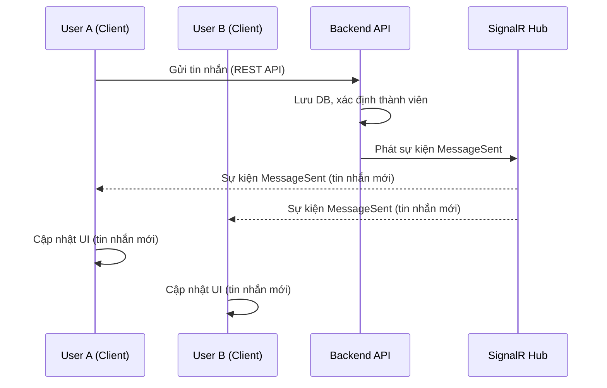

# Tài liệu: Luồng Gửi & Nhận Tin Nhắn Realtime (Vega.Chat.Client)

## 1. Tổng Quan

- Vega.Chat sử dụng SignalR để truyền tải tin nhắn realtime giữa client và server.
- Frontend sử dụng React + TypeScript, hook tùy chỉnh (`useSignalR`, `useSignalREvents`) để quản lý kết nối và sự kiện.
- Tất cả tin nhắn gửi/nhận đều cập nhật UI ngay lập tức, đồng bộ hóa trạng thái qua SignalR.

## 2. Luồng Gửi Tin Nhắn (Client → Server → Client)

### 2.1. Người dùng gửi tin nhắn

- Khi người dùng nhập và gửi tin nhắn (qua UI), hàm handler (trong `useChatHandlers.ts`) sẽ được gọi.
- Handler gọi API REST (`messageService.sendMessage`) để gửi nội dung lên backend.
- Sau khi backend xử lý thành công, backend sẽ phát sự kiện SignalR `MessageSent` tới tất cả client liên quan (bao gồm cả người gửi).

### 2.2. Backend xử lý

- Backend nhận request gửi tin nhắn, lưu vào DB, xác định các thành viên liên quan.
- Backend sử dụng SignalR Hub để phát sự kiện `MessageSent` với payload là tin nhắn mới tới các client đang kết nối.

### 2.3. Client nhận sự kiện

- Tất cả client (bao gồm người gửi) đã kết nối SignalR sẽ nhận được sự kiện `MessageSent`.
- Hook `useSignalREvents` đăng ký lắng nghe sự kiện này, khi nhận được sẽ:
  - Cập nhật state tin nhắn trong context (`ChatContext`)
  - Hiển thị tin nhắn mới trên UI
  - Nếu là người gửi, đảm bảo trạng thái gửi thành công (có thể xóa tin nhắn tạm/thông báo)

## 3. Luồng Nhận Tin Nhắn (Realtime)

- Khi có thành viên khác gửi tin nhắn vào cuộc trò chuyện mà user đang tham gia:
  - Backend phát sự kiện SignalR `MessageSent` tới client.
  - Client nhận sự kiện qua hook `useSignalREvents`, cập nhật state và UI như trên.
  - Nếu user đang xem đúng cuộc trò chuyện, tin nhắn sẽ xuất hiện ngay lập tức.
  - Nếu user không ở đúng phòng chat, có thể hiện badge/thông báo.

## 4. Chi Tiết Kỹ Thuật

### 4.1. Kết nối SignalR

- Kết nối được khởi tạo qua hook `useSignalR`, sử dụng JWT để xác thực.
- Tự động reconnect nếu mất kết nối (delay cố định, tối đa 10 lần).
- Đăng ký/huỷ đăng ký sự kiện qua `useSignalREvents`.

### 4.2. Đăng ký sự kiện

- Các sự kiện chính:
  - `MessageSent`: Nhận tin nhắn mới
  - `MemberAdded`, `MemberRemoved`: Thành viên thay đổi
  - ...
- Khi nhận sự kiện, gọi hàm cập nhật state trong `ChatContext`.

### 4.3. Đảm bảo đồng bộ

- Tất cả client liên quan đều nhận được sự kiện cùng lúc.
- Nếu gửi thất bại (API trả lỗi), UI sẽ thông báo lỗi, không chờ SignalR.
- Nếu gửi thành công, tin nhắn sẽ xuất hiện ngay trên UI nhờ sự kiện SignalR.

## 5. Sơ Đồ Luồng (Sequence Diagram)

## 6. Best Practices

- Luôn gửi tin nhắn qua API, không gửi trực tiếp qua SignalR.
- Luôn lắng nghe sự kiện SignalR để cập nhật UI realtime.
- Đảm bảo xử lý reconnect, cleanup event khi unmount.
- Sử dụng context để đồng bộ state toàn app.

---

<remarks>
Created by: GitHub Copilot
Timestamp: 2025-12-30
</remarks>
